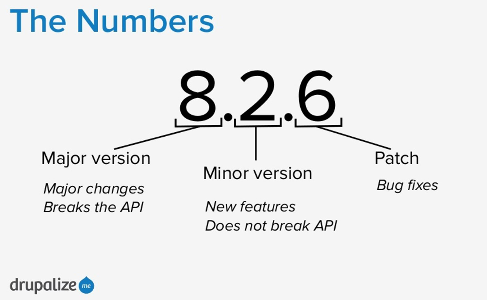

# Npm

## Get version
```powershell
npm -v (or --version)
```

## Get help
```powershell
npm help
npm
```

## Create a package.json file
```powershell
npm init

# Generate it without having it ask any questions
npm init -y (or --yes) 
```

## Manage the npm configuration files
```powershell
# Set
npm config set <key> <value>

// e.g.
npm config set init-author-name "John Doe"
npm set init-license "MIT"


# Get
npm config get <key>

// e.g.
npm config get init-author-name
npm get init-license


# Delete
npm config delete <key>

// e.g.
npm config delete init-author-name
npm config delete init-license
```

## Install a package
```powershell
# As of npm 5.0.0, installed modules are added as a dependency by default, so the --save option is no longer needed

npm install <package_name> --save
// e.g. npm install lodash

npm install <package_name> --save-dev
// e.g. npm install gulp gulp-sass --save-dev

# Installs all dependencies of the package.json file
npm install

# With the --production flag, npm will not install modules listed in devDependencies
npm install --production

# aliases: npm i, npm add
```

## Remove a package
```powershell
npm uninstall <package_name>
// e.g. npm uninstall gulp gulp-sass --save-dev

# aliases: remove, rm, r, un, unlink
```

## Install the specified version of the package
```powershell
npm install [<@scope>/]<package_name>@<version>

// e.g.
npm install lodash@4.17.3
npm install @myorg/privatepackage@1.5.0
```

## Semantic versioning


## Update a package
```powershell
npm update <package_name>

# Caret Dependencies

// package.json contains:

"dependencies": {
  "dep1": "^1.1.1"
}

Then npm update will install dep1@1.2.2, because 1.2.2 is latest and 1.2.2 satisfies ^1.1.1

# Tilde Dependencies

// package.json contains:

"dependencies": {
  "dep1": "~1.1.1"
}

npm update will install dep1@1.1.2, which is equivalent to >=1.1.1 <1.2.0

# aliases: up, upgrade
```

## Global Packages
```powershell
# Install
npm install -g <package_name>

# Display npm root
npm root -g

# Check for outdated packages
npm outdated -g
```

## List installed packages
```powershell
npm ls [[-g] <package_name>]

# Max display depth of the dependency tree.
npm ls --depth 0

# aliases: list, la, ll
```

## Website
[https://www.npmjs.com](https://www.npmjs.com)